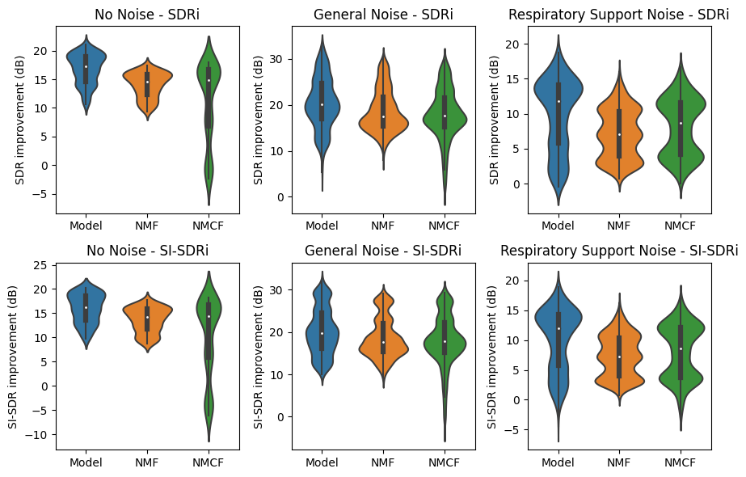
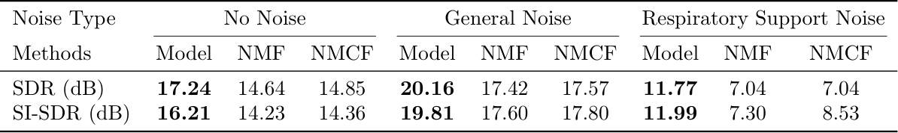
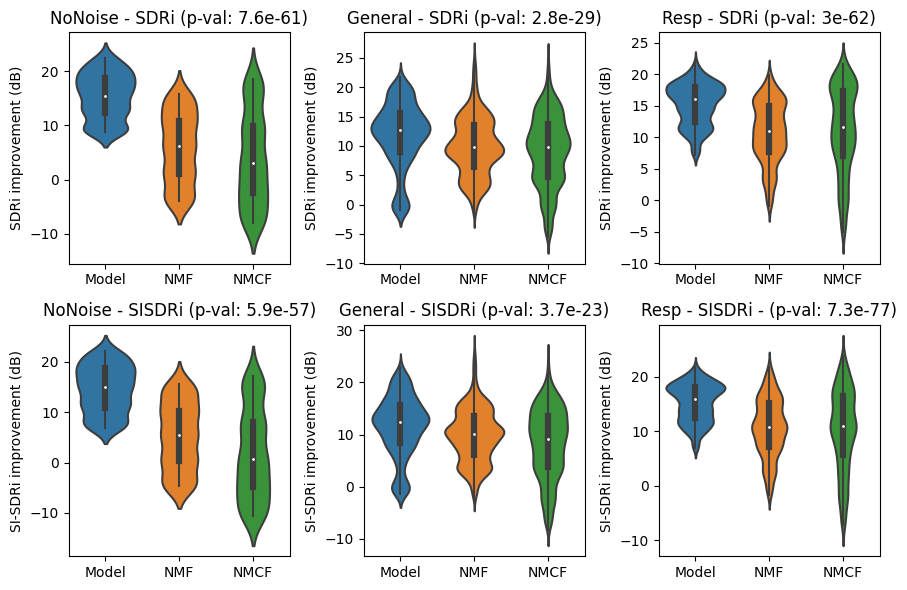
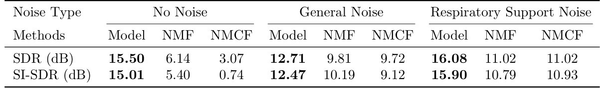

# Neonatal Chest Sound Separation using Deep Learning
Implementation of the neonatal chest sound separation model.

NOTE: MATLAB application has not been created yet, so heart rate and breathing rate analysis along with the previous NMF and NMCF methods are currently not available. This will be implemented in the near future.

## Results
### SDR, SI-SDR result for heart sounds



### SDR, SI-SDR reslut for lung sounds



## Requirements
The following code is written in PyTorch.

## Usage
The pretrained model weights is in `models/model_best.pt` and the model configuration is in `models/model.yaml`.

The following is an example to perform inference using the pretrained model.

```
import torch
from utils import generate_output

# model
model_path = 'models/model_best.pt'
model_config = 'models/model.yaml'

# input
input_wav = torch.rand(1, 40_000)   # must have shape (1, T)

heart_wav, lung_wav = generate_output(input_wav, model_path, model_config)

print(heart_wav.shape)      # shape (T)
print(lung_wav.shape)       # shape (T)
```

The following code allows direct calling from model

```
import torch
import yaml
from models import MaskNet

# model
model_path = 'models/model_best.pt'
model_config = 'models/model.yaml'

# device
device = torch.device('cpu')

# input
input_wav = torch.rand(8, 1, 40_000)   # must have shape (B, 1, T)

# load model
with open(model_config, 'r') as f:
    config = yaml.safe_load(f)
model = MaskNet(**config)
state_dict = torch.load(model_path, map_location=device)
model.load_state_dict(state_dict)
model.to(device)

# forward pass
output_wav = model(input_wav)       # output have shape (B, 2, T)

# channel 0 contains heart sounds
# channel 1 contains lung sounds
heart_wav = output_wav[:, 0, :]     # shape (B, T)
lung_wav = output_wav[:, 1, :]      # shape (B, T)

print(heart_wav.shape)
print(lung_wav.shape)
```

## Training
A training configuration file is used to pass to configure the training parameters. An example of `config.yaml` is provided below:
```
# hyperparam
hyperparam:
  optimizer: 'AdamW'   # SGD, Adam, AdamW
  weights: '1.0, 1.0'

  batch_size: 8
  learning_rate: 3.e-4
  weight_decay: 0.1
  epochs: 40
  crop_len: 7    # time series in seconds
  loss: 'SNR'     # SDR, LogMSE, SNR, SASDR
  clip: 5

  # data
  snr_step: 5
  snr_min_l: -10
  snr_min_n: -20

  # scheduler
  factor: 0.5
  patience: 3
  earlystop_patient: 3

  # model stuff
  model_config:
    # number of input sources
    num_sources: 2
    stochastic: False
    
    # encoder/decoder parameters
    enc_kernel_size: 512
    enc_num_feats: 512
    enc_type: 'convolution'   # convolution, convolution, spectrogram, spectrogram2
    dec_type: 'convolution'   # convolution, group-convolution, spectrogram
    
    # conformer parameters
    msk_num_feats: 512
    msk_num_heads: 4
    msk_ffn_expand: 4
    msk_num_layers: 17
    msk_dropout: 0.3
    msk_individual_mask: True
    msk_type: 'transformer'   # conformer, transformer, transformer_relative

    msk_use_conv: True
    msk_kernel_size: 3
    msk_conv_layers: 6

    # wavelet analysis
    use_wavelet: False
    wavelet_scale: 8
    mother_wavelet: 'db10'

# dataset config
fold: 1     # 1 to 7
num_workers: 4
train_dir: 'path/to/training_dir'
train_type: 'all_c'    # general, resp_support, all, NoNoise, Cry, all_c

# model directory
model_dir: 'path/to/save/model'
train_resume: null # or 'path/to/pretrained/model'
```

`config.yaml` should be in the same directory as `train.py`. To start training, run the following command
```
python train.py
``` 

## Evaluation
To run the evaluation code, `config_eval.yaml` file is required. An example of such configuration file is provided

```
# model
model_type: 'nn'                        # nn, NMF, NMCF, traditional
model_dir: 'path/to/model/weights'      # 'models/model_best.pt'
model_config: 'path/to/model/config'    # 'models/model.yaml'
noise_type: 'resp_support'              # general, resp_support, NoNoise

fold: 1
# eval
eval_dir: 'path/to/evaluation_dir'
eval_dir_sync: 'path/to/vital_sign_chestsound_dir'

# file export
eval_file_sxr: 'sxr.csv'
eval_file_hrbr: 'hrbr.csv'
eval_file_sqi: 'signal_quality.csv'

# device
device: 'cpu'   # 0, 'cpu'

preprocess: False   # preprocess chest sounds
```

To run SDR and SI-SDR evaluation, execute the following command

```
python evaluate.py -opt sxr
```

To run the heart rate and breathing rate evaluation, the following command can be executed. Note that MATLAB is needed as the heart rate and breathing rate evaluation code is written in MATLAB.

```
python evaluate.py -opt hrbr
```

## Known Issues
The following are known issues with the current implementation:

- The MATLAB application has memory leak issues. The problem seems to be due the the MATLAB application, not the interface.

If any issue is found, please contact: Yang.Poh@monash.edu

- [x] Remove file directory in config
- [ ] Remove evaluation code from heart_sound_analysis.
- [ ] Verify that the evaluation code from Ethan can be ran.
- [ ] Export MATLAB application into Python
